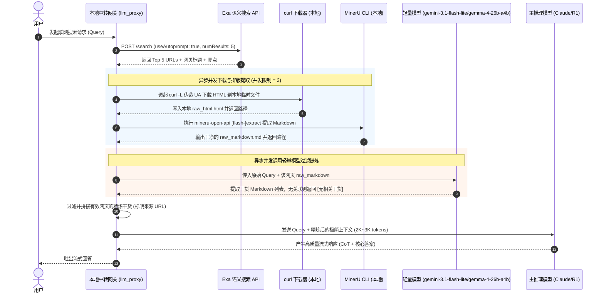

# 基于 Exa + MinerU + 独立轻量 LLM 的智能网页检索与精炼管道设计方案

本方案旨在为 `llm_proxy` 本地网关设计一套高效、低成本的网页检索、精准提取与内容提炼管道。该管道能够有效应对网络反爬、网页 HTML 噪音多、以及大型推理模型（如 Claude 3.5 Sonnet / DeepSeek-R1）直接处理原始长文本时所面临的 Reasoning Token 浪费和上下文膨胀问题。

---

## 1. 系统核心模块与设计思路

### 1.1 Exa 联网搜索与链接发现
Exa（前身为 Metaphor）是一款面向大语言模型设计的语义搜索引擎。与基于关键词匹配的传统搜索不同，Exa 采用神经网络搜索，能够根据自然语言查询的深层含义返回质量更高、更符合 AI 需求的网页 URL。

*   **调用方式**：本地网关在收到用户的联网搜索请求时，可以通过配置的 Exa MCP 工具或直接发起 HTTPS API 请求。
*   **请求优化策略**：
    *   `useAutoprompt: true`：使 Exa 自动将普通的用户 Query 转换为高质量的语义匹配 Prompt，显著提高检索精准度。
    *   `numResults` 控制：默认设置 `5` 个，防止下游并发下载和提炼阶段的负载过高。
    *   `highlights` 参数：开启亮点返回，可为后续的快速预处理提供额外的语义定位线索。

### 1.2 网页抓取与 MinerU 精准提取
在获取目标 URL 后，我们需要拉取网页内容并转换为排版干净的 Markdown 格式。针对网页端频繁存在的反爬验证以及原始 HTML 充斥广告、页脚等噪声的问题，我们设计了以下双阶段提取方案：

*   **坚固下载阶段**：直接使用本地 `curl -L` 并伪造常见浏览器的 `User-Agent` 与 `Accept` 头部下载 HTML。这比直接使用简单的 NodeJS HTTP Client 能更好地通过反爬限制。对于地域限制导致的下载失败，支持配置代理参数。
*   **MinerU 精准提取阶段**：
    *   **快速免 Token 模式（针对 < 10MB 的 HTML 文件）**：优先使用 `mineru-open-api flash-extract <file> -o <dir>`。该模式在本地进行免 Token 的快速清洗转换，转换速度极快且不消耗云端 Token。
    *   **高精度模式（针对大文件或复杂页面）**：降级调用 `mineru-open-api extract <file> -f html -o <dir>` 精准解析复杂 HTML 结构（支持表格转 HTML、公式转 LaTeX 等）。

### 1.3 独立廉价/快速模型预处理与内容整理
网页直接经 MinerU 清洗出来的 Markdown 内容可能依旧包含大量的干扰信息（如关联推荐、侧边栏内容、冗长的前置背景介绍）。如果直接将其喂给主推理模型，会引发以下问题：
1.  **极高的推理成本**：高 Reasoning 属性的模型（如 DeepSeek-R1）在消化原始大上下文时，会产生非常庞大的内部 CoT（思维链）Token，成本极其昂贵。
2.  **响应延迟 (TTFT) 激增**：大上下文会导致首字响应时间明显变长。
3.  **大模型注意力分散**：原始文本的细微噪声可能干扰主模型的逻辑链条。

*   **解决方案**：
    引入一个**轻量过滤层 (Pre-Filter)**，单独配置一个高并发、超便宜、高吞吐的快速大模型（例如 `gemini-3.1-flash-lite` 或 `gemma-4-26b-a4b`）。
    该轻量模型使用专门设计的 Prompt，对照用户的 Query，将每个网页的 Markdown 内容提炼为只包含**事实、数据与核心观点**的精简 Markdown 列表（通常提炼后只需 500-1000 Token）。
*   **去重与过滤**：如果轻量模型判断该网页不包含与 Query 相关的干货，直接输出 `[无相关干货]` 进行过滤，最终仅向主推理模型输入高度相关的“干货上下文”。

---

## 2. 系统架构与时序图

以下是网页检索、抓取、提取和精炼的完整数据流向。我们通过并发控制器（例如 `p-limit`）实现多网页的并行处理。



---

## 3. 工程实现步骤与伪代码

在 Node.js / Bun 环境下，我们使用 `Bun.spawn` 异步执行本地命令，并使用 `p-limit` 控制并发度，保证在不阻塞网关主事件循环的同时快速完成多任务处理。

### 3.1 核心管道类：`WebSearchPipeline.ts`

```typescript
import { spawn } from "bun";
import * as fs from "fs/promises";
import * as path from "path";
import pLimit from "p-limit";

// 配置参数结构
export interface PipelineConfig {
  exaApiKey: string;
  cheapLlmApiKey: string;
  cheapLlmBaseUrl: string;
  cheapLlmModel: string;
  tempDirectory: string;
  maxSearchResults: number;
  maxConcurrency: number;
}

// 精炼后的上下文单元
export interface RefinedWebContext {
  url: string;
  title: string;
  summary: string;
}

export class WebSearchPipeline {
  private config: PipelineConfig;

  constructor(config: PipelineConfig) {
    this.config = {
      maxSearchResults: 5,
      maxConcurrency: 3,
      cheapLlmModel: "gemini-3.1-flash-lite", // 默认选用高性价比 Flash 模型
      ...config
    };
  }

  /**
   * 管道主入口：输入 Query，返回拼接好的 Markdown 干货上下文
   */
  public async execute(query: string): Promise<string> {
    // 确保临时工作目录存在
    await fs.mkdir(this.config.tempDirectory, { recursive: true });

    // Step 1: 调用 Exa 获取语义相关的 URL 列表
    const searchResults = await this.searchExa(query);
    if (searchResults.length === 0) {
      return "（未检索到相关网页资料）";
    }

    // Step 2 & 3: 并发下载并使用 MinerU CLI 精准解析网页
    const limit = pLimit(this.config.maxConcurrency);
    const extractionTasks = searchResults.map(result => {
      return limit(async () => {
        try {
          return await this.downloadAndExtract(result.url, result.title);
        } catch (error) {
          console.error(`[Pipeline] 网页提取失败 [${result.url}]:`, error);
          return null;
        }
      });
    });

    const extractedPages = (await Promise.all(extractionTasks)).filter(r => r !== null) as any[];

    // Step 4: 并发调用独立廉价模型，提炼核心干货
    const refineTasks = extractedPages.map(page => {
      return limit(async () => {
        try {
          return await this.refinePageContent(query, page);
        } catch (error) {
          console.error(`[Pipeline] 网页干货精炼失败 [${page.url}]:`, error);
          return null;
        }
      });
    });

    const refinedResults = (await Promise.all(refineTasks))
      .filter(r => r !== null && r.summary !== "[无相关干货]" && r.summary !== "[精炼提取失败]") as RefinedWebContext[];

    // Step 5: 清理本地产生的临时 HTML 文件和 MinerU 目录
    await this.cleanupTempFiles(extractedPages);

    // Step 6: 组装上下文输出给主模型
    if (refinedResults.length === 0) {
      return "（检索到网页，但未提炼出与查询直接相关的有效干货信息）";
    }

    return this.formatContext(refinedResults);
  }

  /**
   * 1. 深度检索与链接发现 (Exa API)
   */
  private async searchExa(query: string): Promise<{ url: string; title: string }[]> {
    try {
      const response = await fetch("https://api.exa.ai/search", {
        method: "POST",
        headers: {
          "Content-Type": "application/json",
          "x-api-key": this.config.exaApiKey,
        },
        body: JSON.stringify({
          query: query,
          useAutoprompt: true, // 自动转换语义 prompt
          numResults: this.config.maxSearchResults,
        }),
      });

      if (!response.ok) {
        throw new Error(`Exa API 状态码异常: ${response.status}`);
      }

      const data = await response.json() as any;
      return (data.results || []).map((r: any) => ({
        url: r.url,
        title: r.title || "无标题网页"
      }));
    } catch (error) {
      console.error("[Pipeline] Exa 联网检索错误:", error);
      return [];
    }
  }

  /**
   * 2. 网页抓取与 MinerU 本地提取
   */
  private async downloadAndExtract(url: string, title: string) {
    // 根据 URL 生成哈希，确保临时文件命名唯一
    const encoder = new TextEncoder();
    const data = encoder.encode(url);
    const hashBuffer = await crypto.subtle.digest("SHA-256", data);
    const hashArray = Array.from(new Uint8Array(hashBuffer));
    const urlHash = hashArray.map(b => b.toString(16).padStart(2, "0")).join("").slice(0, 16);

    const rawHtmlPath = path.join(this.config.tempDirectory, `raw_${urlHash}.html`);
    const outputDir = path.join(this.config.tempDirectory, `out_${urlHash}`);

    // (A) curl 下载 HTML，配置 User-Agent 防止被常规反爬拦截，设置超时防止慢响应阻塞管道
    const curl = spawn([
      "curl", "-L",
      "--max-time", "15",
      "--connect-timeout", "5",
      "-H", "User-Agent: Mozilla/5.0 (Macintosh; Intel Mac OS X 10_15_7) AppleWebKit/537.36 (KHTML, like Gecko) Chrome/120.0.0.0 Safari/537.36",
      "-o", rawHtmlPath,
      url
    ]);

    const curlExit = await curl.exited;
    if (curlExit !== 0) {
      throw new Error(`curl 下载网页 HTML 失败 (退出码: ${curlExit})`);
    }

    // 读取 HTML 文件大小，判断选择提取策略
    const stats = await fs.stat(rawHtmlPath);
    const fileSizeMB = stats.size / (1024 * 1024);

    let mineruArgs: string[];
    if (fileSizeMB < 10.0) {
      // 优先调用免 Token 快速转换模式
      mineruArgs = ["mineru-open-api", "flash-extract", rawHtmlPath, "-o", outputDir];
    } else {
      // 大文件/复杂网页使用标准精确模式
      mineruArgs = ["mineru-open-api", "extract", rawHtmlPath, "-f", "html", "-o", outputDir];
    }

    // (B) 调起本地 MinerU CLI
    const mineru = spawn(mineruArgs);
    const mineruExit = await mineru.exited;
    if (mineruExit !== 0) {
      // 快速清理并抛出异常
      await fs.unlink(rawHtmlPath).catch(() => {});
      throw new Error(`MinerU 提取排版 Markdown 失败 (退出码: ${mineruExit})`);
    }

    // (C) 递归寻获 MinerU 产出的 .md 文件并读取
    const files = await fs.readdir(outputDir, { recursive: true });
    const mdFile = files.find(f => typeof f === "string" && f.endsWith(".md"));
    if (!mdFile) {
      throw new Error("未能在 MinerU 输出中找到 Markdown 文件");
    }

    const resolvedMdPath = path.join(outputDir, mdFile as string);
    const rawMarkdown = await fs.readFile(resolvedMdPath, "utf-8");

    return {
      url,
      title,
      rawMarkdown,
      outputDir,
      rawHtmlPath
    };
  }

  /**
   * 3. 廉价模型提炼预处理 (调用 API)
   */
  private async refinePageContent(query: string, page: any): Promise<RefinedWebContext> {
    const prompt = `你是一个专业的信息提炼助手。请针对用户的原始 Query，从给定的网页 Markdown 内容中提取最核心、最相关的干货。

## 用户的原始 Query
${query}

## 提取规则
1. 仅提取与 Query 直接相关的核心事实、具体数据、官方结论、背景逻辑或解决方案。
2. 剔除所有与 Query 无关的内容，如作者闲聊、广告推广、导航、页脚等无关段落。
3. 保持客观中立，以精炼的 Markdown 无序列表形式输出。
4. 如果网页中不包含任何与 Query 相关的内容，必须且只能回复："[无相关干货]"。

## 待提炼的网页内容（来源：${page.title} - ${page.url}）
---
${page.rawMarkdown.slice(0, 30000)} // 截取前30k字符防止超出模型上下文上限
---`;

    try {
      const response = await fetch(`${this.config.cheapLlmBaseUrl}/chat/completions`, {
        method: "POST",
        headers: {
          "Content-Type": "application/json",
          "Authorization": `Bearer ${this.config.cheapLlmApiKey}`
        },
        body: JSON.stringify({
          model: this.config.cheapLlmModel,
          messages: [{ role: "user", content: prompt }],
          temperature: 0.1 // 低温度确保提炼的事实高度准确，不随意生成
        })
      });

      if (!response.ok) {
        throw new Error(`廉价模型 API 响应异常: ${response.status}`);
      }

      const data = await response.json() as any;
      const summary = data.choices[0].message.content.trim();

      return {
        url: page.url,
        title: page.title,
        summary
      };
    } catch (error) {
      console.error(`[Pipeline] 独立模型提炼错误 [${page.url}]:`, error);
      return {
        url: page.url,
        title: page.title,
        summary: "[精炼提取失败]"
      };
    }
  }

  /**
   * 格式化最终拼装的参考上下文
   */
  private formatContext(results: RefinedWebContext[]): string {
    let output = `## 联网搜索参考背景知识 (由 ${this.config.cheapLlmModel} 提炼过滤)\n\n`;
    results.forEach((res, index) => {
      output += `### [文献 ${index + 1}] ${res.title}\n`;
      output += `**链接**: ${res.url}\n`;
      output += `**核心提取干货**:\n${res.summary}\n\n`;
    });
    return output;
  }

  /**
   * 清理本地产生的临时 HTML 文件和 MinerU 目录
   */
  private async cleanupTempFiles(pages: any[]): Promise<void> {
    for (const page of pages) {
      try {
        await fs.unlink(page.rawHtmlPath).catch(() => {});
        await fs.rm(page.outputDir, { recursive: true, force: true }).catch(() => {});
      } catch (err) {
        console.error(`[Pipeline] 临时文件清理失败:`, err);
      }
    }
  }
}
```

### 3.2 网关与主推理模型的对接整合

在本地网关中，当收到 `/v1/responses` 或者是 `/v1/chat/completions` 请求时，网关可通过此管道快速提炼信息并注入系统提示词。

```typescript
import { WebSearchPipeline } from "./WebSearchPipeline";

const webPipeline = new WebSearchPipeline({
  exaApiKey: process.env.EXA_API_KEY || "",
  cheapLlmApiKey: process.env.CHEAP_LLM_API_KEY || "",
  cheapLlmBaseUrl: process.env.CHEAP_LLM_BASE_URL || "https://api.xiaomimimo.com/v1",
  cheapLlmModel: "gemini-3.1-flash-lite", // 极速且极廉价的 Gemini Flash 模型
  tempDirectory: "/tmp/llm_proxy_search",
  maxSearchResults: 5,
  maxConcurrency: 3
});

export async function handleGatewayChatRequest(requestBody: any) {
  const messages = requestBody.messages || [];
  const latestMessage = messages[messages.length - 1]?.content || "";
  
  // 1. 判断是否触发联网搜索（基于 tools 配置或显式 flag）
  const needsWebSearch = detectSearchTrigger(requestBody);
  
  let webContextMarkdown = "";
  if (needsWebSearch) {
    try {
      // 执行检索提炼管道
      webContextMarkdown = await webPipeline.execute(latestMessage);
    } catch (err) {
      console.error("联网检索与提炼失败:", err);
      webContextMarkdown = "（联网检索提炼失败）";
    }
  }
  
  // 2. 如果存在提炼后的网页干货，以 System Message 的形式注入
  const modifiedMessages = [...messages];
  if (webContextMarkdown) {
    const systemPromptInject = {
      role: "system",
      content: `以下是系统为您实时进行 Exa 搜索并由 MinerU + 快速模型提炼的最新背景信息。请结合这些最新干货背景回答用户：\n\n${webContextMarkdown}`
    };
    modifiedMessages.unshift(systemPromptInject);
  }
  
  // 3. 转发给高精度的主推理模型（如 Claude 3.5 Sonnet / DeepSeek-R1）
  const forwardResponse = await fetch("https://api.deepseek.com/v1/chat/completions", {
    method: "POST",
    headers: {
      "Content-Type": "application/json",
      "Authorization": `Bearer ${process.env.DEEPSEEK_API_KEY}`
    },
    body: JSON.stringify({
      ...requestBody,
      messages: modifiedMessages // 携带提炼后的极简上下文，节省 reasoning tokens
    })
  });
  
  return forwardResponse;
}

function detectSearchTrigger(requestBody: any): boolean {
  // 基于 Responses API 的 tools 配置或显式 flag 判断，而非关键词匹配
  const tools = requestBody.tools || [];
  const hasSearchTool = tools.some((t: any) =>
    t.type === "builtin_function"?.function?.name === "$web_search" ||
    t.type === "web_search" ||
    t.type === "function"?.function?.name?.includes("search")
  );
  const hasSearchFlag = requestBody.search === true || requestBody.web_search === true;
  return hasSearchTool || hasSearchFlag;
}
```

---

## 4. 系统关键优势

1.  **极高性价比与低延迟**：通过本地 MinerU 进行预提取和廉价的 `gemini-3.1-flash-lite` 进行前置提炼，将原始动辄数万 Token 的网页内容，压缩为仅 1K-2K Token 的高价值干货，直接为主模型节省 90% 以上的输入上下文和推理 Token 成本，响应时间大幅缩短。
2.  **规避反爬限制**：使用坚固的 `curl` 客户端结合高解析率的 MinerU 提取，能够稳定提取受 Cloudflare、动态脚本限制等网页的正文，避开原生 Node JS HTTP 请求的劣势。
3.  **防噪声与幻觉**：轻量级模型对网页进行了“去重去噪”，排除了无关的推广和噪音，使主模型能够聚焦于精准事实，极大减少因杂乱文本导致的逻辑幻觉。
